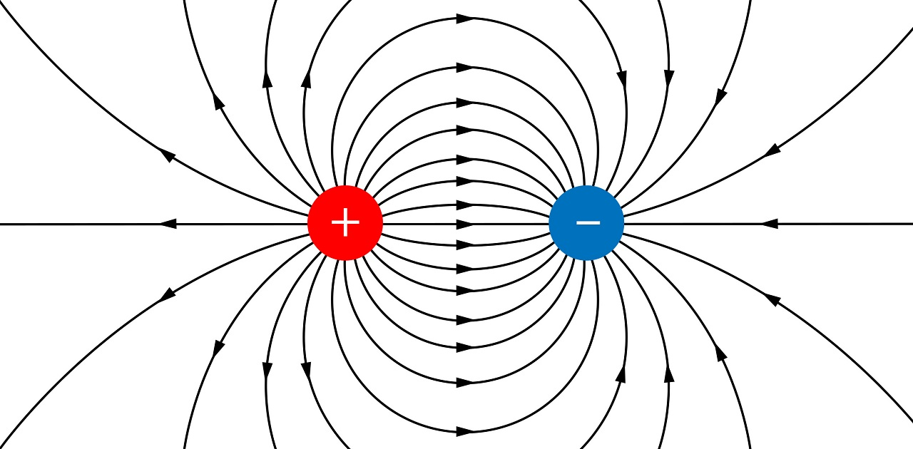
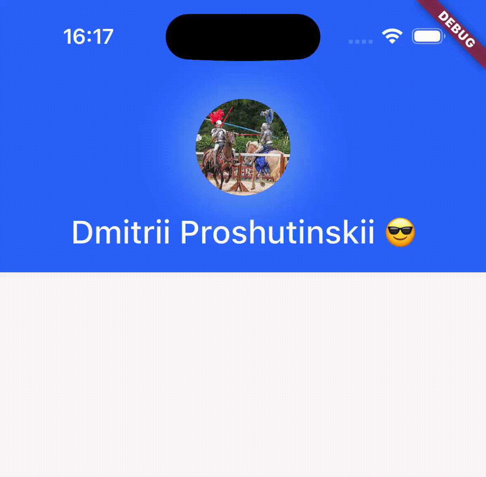

# Recreating the Telegram Profile Effect with Metaballs and Flutter

On iOS with Dynamic Island, Telegram’s profile screen has a distinctive effect: when you scroll up slowly, the avatar *flows* into the Dynamic Island. This project reproduces that behavior in Flutter using a fragment shader and the metaballs algorithm.


This README explains what metaballs are, how they are implemented in the shader, how the profile image is drawn inside the moving blob, how everything is wired in Flutter, and how the Telegram-like behavior (snapping, background, blur) is achieved. Code references point to the actual implementation.

**Keywords:** metaballs, shader, GLSL, Flutter, CustomPainter, FragmentShader, Telegram

IMPORTANT: This effect will work correctly only on iOS because only iOS has dynamic island

---

## Introduction

The “blob merge” effect is often called **metaballs** (or blobby objects, isosurfaces). The idea: at each pixel we compute a scalar *field* as the sum of contributions from several “blobs.” Where the field exceeds a **threshold**, we draw; otherwise we don’t. When two blobs are close, their fields add up and the shapes appear to merge.

A simple mental model: think of each blob as a charge contributing to an electric field. The field is stronger near the charges and weaker farther away. Where the combined field is above a certain level, we show the surface.




For a sphere of radius \(r_i\) centered at \(c_i\), a standard choice is:

\[
f(p) = \sum_{i} \frac{r_i^2}{|p - c_i|^2}
\]

Here \(p\) is the pixel position, \(c_i\) the center, \(r_i\) the radius. We take the coefficient as 1; the **threshold** then controls where the visible boundary appears. For each pixel we sum these terms; where the sum \(\ge\) threshold we treat the pixel as inside the blob. Bringing two blobs close makes the field between them exceed the threshold, so they visually merge.

---

## The Fragment Shader

A fragment shader is a function that, for a given pixel, returns its color. The GPU runs it for every pixel. In Flutter we use a fragment shader (loaded from `shaders/metaballs.frag`) and draw a full-screen rect with it.

A minimal two-circle version of the idea looks like this:

```glsl
#include <flutter/runtime_effect.glsl>
uniform vec2 uCenter1;
uniform float uRadius1;
uniform vec2 uCenter2;
uniform float uRadius2;
uniform float uThreshold;
out vec4 fragColor;

void main() {
    vec2 pos = FlutterFragCoord().xy;
    vec2 d1 = pos - uCenter1;
    vec2 d2 = pos - uCenter2;
    float field = (uRadius1*uRadius1)/(dot(d1,d1) + 0.0001)
                + (uRadius2*uRadius2)/(dot(d2,d2) + 0.0001);
    float edge = 0.04;
    float alpha = smoothstep(uThreshold - edge, uThreshold + edge, field);
    fragColor = vec4(0.0, 0.0, 0.0, alpha);
}
```

The `+ 0.0001` avoids division by zero. **smoothstep** gives a soft edge: 0 when `field` is below the lower bound, 1 above the upper bound, and a smooth transition in between. Without it, the blob would have a hard, aliased border.

The **production shader** in this repo does more:

- **Ball 1** is a rounded rectangle (Dynamic Island) using an SDF-style formula instead of a simple circle.
- **Ball 2** (avatar) has a **dynamic radius** that shrinks as it approaches the island so the merge looks natural.
- The avatar is filled with a **sampled image** and **blur** that increases near the island.

See: [shaders/metaballs.frag](shaders/metaballs.frag) for the full implementation, including RRect field, `effectiveR`, UV mapping, and Fibonacci-spiral blur.

---

## Image Inside the Shader

We draw the profile photo inside the moving blob directly in the shader. Two things matter: (1) mapping the image so it fits the circle without stretching, and (2) using the **effective radius** for that mapping.

### Why Effective Radius Is Not the Raw Radius

The visible boundary of a blob is where \(f(p) = \text{threshold}\). For a single sphere \(f = R^2/\text{dist}^2\), so at the boundary \(\text{dist}^2 = R^2/\text{threshold}\), i.e. \(\text{dist} = R/\sqrt{\text{threshold}}\). So the **effective radius** (the distance from center to the visible edge) is:

\[
R_{\text{effective}} = \frac{R}{\sqrt{\text{threshold}}}
\]

If \(\text{threshold} = 2\), the edge is at \(R/\sqrt{2}\), not at \(R\). If you map the image using the raw radius \(R\), it will be clipped or extend past the visible circle. So we map by **effective radius**:

\[
R_{\text{effective}} = \frac{R}{\sqrt{\text{threshold}}}
\]

In our shader we use \(\text{threshold} = 1.0\), so effective radius equals the radius and the math stays simple. See [shaders/metaballs.frag](shaders/metaballs.frag) around `effectiveR` and the UV computation.


Wrong mapping (using raw radius) vs correct (using effective radius):

  


### Fitting the Image in the Circle

The circle is symmetric; the image usually is not. We **fit** the image (aspect-ratio preserving): scale so the image fits inside the circle and derive UVs from the position relative to the center, normalized by the effective radius. We **clamp** UVs to \([0,1]\) so we never sample outside the texture. The shader branches on `imgAspect` to handle landscape vs portrait images. Code: [shaders/metaballs.frag](shaders/metaballs.frag) (UV and `pixToUv` block).

---

## Drawing in Flutter

To draw the shader on screen:

1. In `initState`, load the shader: `FragmentProgram.fromAsset('shaders/metaballs.frag')`.
2. Use a **CustomPainter** (e.g. `MetaBallsPainter`) and pass it the `FragmentProgram` and the avatar `ui.Image`.
3. In `paint`, call `program.fragmentShader()` to get a shader instance.
4. Set **uniforms in the same order as in the GLSL**: `setFloat(0, ...)`, `setFloat(1, ...)`, … for vec2 (2 floats), float, etc. Set the image with `setImageSampler(0, image)`.
5. Draw with `canvas.drawRect(rect, Paint()..shader = shader)`.
6. **Dispose** the shader after use; it holds GPU resources.

Implementation: [lib/metaballs.dart](lib/metaballs.dart) — `_loadResources`, `MetaBallsPainter.paint`. The app entry and status bar wiring are in [lib/main.dart](lib/main.dart).

---

## Replicating Telegram Behavior

Everything is driven by one variable: **movingY**, the Y coordinate of the moving blob (avatar) center. The avatar starts lower on the screen and moves up as the user drags (or as you would scroll). That value is passed to the shader as `uCenter2.y`.

### Dynamic Island as One Blob

The “Dynamic Island” is the **first blob**: a fixed rounded rectangle (RRect). Its center and size are constants in the painter. The **second blob** is the avatar circle; its center Y is `movingY`. When the two get close, the combined field exceeds the threshold and they merge on screen. So the island is static; the avatar “flows” into it. See [lib/metaballs.dart](lib/metaballs.dart) for `_snapTop` / `_snapBottom` and [shaders/metaballs.frag](shaders/metaballs.frag) for the two fields.

### Snapping

When the user releases the drag, we **snap** to one of two positions: fully expanded (avatar down) or fully merged (avatar up). We compare `movingY` to a midpoint (e.g. one-third of the range); if below, snap to top, else to bottom. The snap is animated with a short duration and easeOutCubic. Code: [lib/metaballs.dart](lib/metaballs.dart) — `onPanEnd`, `_snapTo`, and the snap constants.

### Changing Radius

As the avatar approaches the island, its **radius** in the shader is reduced (interpolated from full size down to match the island’s corner size). That keeps the merge visually and numerically stable. The distance from the avatar center to the RRect surface (`surfDist`) is used in the shader to compute this. See [shaders/metaballs.frag](shaders/metaballs.frag) — `surfDist`, `proximity`, `actualR2`.

---

## Finishing Touches

- **Blur:** As the avatar gets closer to the island, the image is blurred more (blur radius 0–20, 56 samples along a Fibonacci spiral with Gaussian weights). References: [Phi](https://mini.gmshaders.com/p/phi), [Blur philosophy](https://mini.gmshaders.com/p/blur-philosophy). Implemented in [shaders/metaballs.frag](shaders/metaballs.frag) — `sampleBlurred`, `blurProximity`, `blurRadius`.
- **Darkening:** The image is darkened near the merge (Telegram does the same); the shader mixes toward black using the field ratio.
- **Background:** Background color lerps from transparent to blue as `movingY` increases (expanded state). Same lerp parameter as in the article: `(movingY - 30) / (_snapBottom - 30)` clamped. Code: [lib/metaballs.dart](lib/metaballs.dart) — `Container` color.
- **Text and status bar:** Text color and size depend on `movingY` (e.g. black when high, white when low; font size 17–26). The host app uses `MetaBallsView.onStatusBarStyleChange` to switch status bar style so icons stay readable. Implemented in [lib/metaballs.dart](lib/metaballs.dart) (text `TextStyle`, `_notifyStatusBarStyle`) and [lib/main.dart](lib/main.dart) (`AnnotatedRegion<SystemUiOverlayStyle>`).
- **Shadow:** A circular `BoxShadow` behind the avatar separates it from the background; its opacity and color also lerp with `movingY`.

---

## Result



## Running the Project

```bash
flutter pub get
flutter run
```

Ensure `assets/avatar.jpg` exists (or change the asset path in [lib/metaballs.dart](lib/metaballs.dart) in `_loadResources`). The shader is loaded from `shaders/metaballs.frag` (see `pubspec.yaml` assets if you move files).

IMPORTANT: This effect will work correctly only on iOS because only iOS has dynamic island
